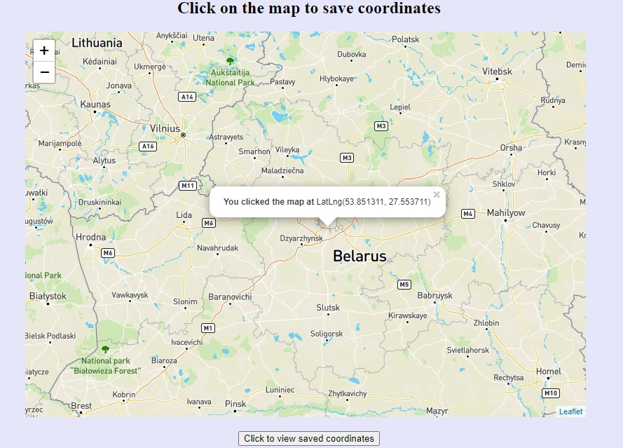
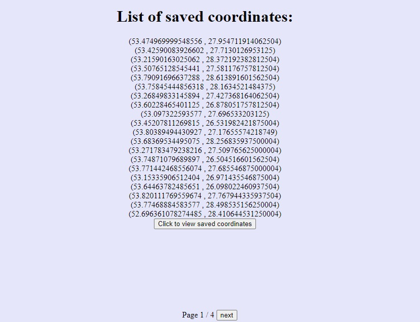
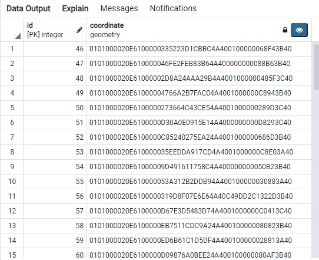

This application was made for getting and saving coordinates to the database on each click on the map.
It was made by using Django, PostgreSQL(PostGIS), Leaflet, GDAL.

Here user can click on any place on the map and get coordinates of this place.
####Map view:
 

On every click application saves data of coordinates which was chosen by the user.
Also pagination is provided, so user can view other pages of saved coordinates.
####Here is the list of saved coordinates:
 

####On this picture we can see coordinates which are saved in database:
 